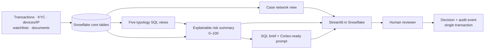
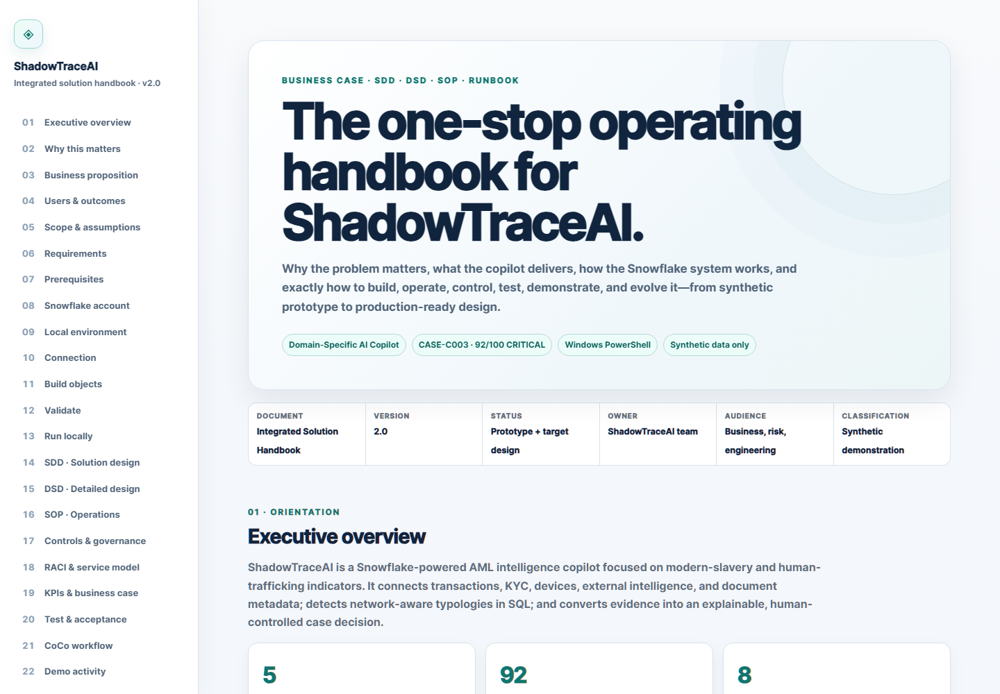

# ShadowTraceAI: AML Intelligence Copilot on Snowflake

> “ShadowTraceAI is a Snowflake-powered AML intelligence copilot that detects
> modern slavery risk patterns, explains connected account evidence, and turns
> suspicious alerts into audit-ready investigation decisions.”

[](https://hack2skill.com/event/cococlihack/)
[](https://www.snowflake.com/)
[](#reviewer-decision-flow)

## Project description

ShadowTraceAI is a focused Snowflake data application for modern-slavery and
human-trafficking AML investigations. It unifies transaction activity,
KYC/customer profiles, device/IP access, adverse media/watchlist hits, and
document metadata; detects network-aware typologies in SQL; produces an
explainable 0–100 score and investigation brief; and records a named reviewer's
decision with a linked audit event.

**Hackathon track:** **Domain-Specific AI Copilot** (best fit). The application
understands AML-specific entities and typologies, supports a realistic
investigator workflow, and recommends an action rather than returning generic
text. It also demonstrates the second-best fit,
**Intelligent Workflow Automation Agent**, through its alert-to-decision flow.

This directly matches the hackathon's emphasis on real-world Snowflake
applications, end-to-end execution, and decision support. The published rubric
weights technical execution at 40%, real-world relevance at 30%, and solution
completeness at 30%.

## Problem

Modern-slavery and human-trafficking risk rarely appears in one obvious payment.
AML analysts manually piece together:

- employer payroll and rapid onward transfers;
- worker, controller, and funnel accounts;
- shared device/IP access;
- KYC occupation, geography, sector, and beneficial ownership;
- watchlist, registry, and adverse-media signals;
- payroll, identity, contract, and accommodation documents.

That fragmentation increases review time, obscures network behavior, and makes
consistent explanations and audit reconstruction difficult.

## Solution

ShadowTraceAI creates one evidence plane inside Snowflake:

1. typed tables ingest structured evidence and semi-structured document metadata;
2. five SQL views detect modern-slavery typologies;
3. a network view exposes connected accounts and funds flow;
4. an explainable SQL view calculates risk, evidence strength, top factors, and route;
5. a deterministic brief plus optional Cortex summary turns evidence into reviewer context;
6. a native Streamlit app provides the investigation workspace;
7. one stored-procedure transaction persists the human decision and audit event.

Snowflake data, SQL, Cortex-ready intelligence, and Streamlit form the complete
core architecture.

## Architecture



See [docs/architecture.md](docs/architecture.md) for the detailed component and
`CASE-C003` network diagrams.

## Explainable risk scoring

The final score is not hard-coded by case ID. It is a visible additive model:

| Component | Maximum | `CASE-C003` | Evidence |
|---|---:|---:|---|
| Wage harvesting | 25 | 25 | Five workers transfer ~90% of wages within hours |
| Account control | 25 | 25 | Seven connected accounts share a device and IP |
| Spending anomaly | 14 | 14 | Minimal everyday spending; rapid wage depletion |
| Geographic risk | 12 | 12 | Cross-border recruitment plus foreign cash-out |
| Sector risk | 8 | 8 | Construction plus incomplete beneficial ownership |
| External intelligence | 4 | 4 | High-risk adverse-media and linked watchlist matches |
| Document evidence | 4 | 4 | Four documents with exploitation indicators |
| **Total** | **100** | **92** | **CRITICAL · STRONG** |

Risk bands are `LOW < 40`, `MEDIUM 40–69`, `HIGH 70–89`, and
`CRITICAL ≥ 90`. The critical route is a recommendation to a reviewer, never an
autonomous SAR filing.

## Snowflake objects created

### Tables

- `accounts`
- `transactions`
- `kyc_profiles`
- `device_ip_signals`
- `external_watchlist`
- `document_evidence`
- `case_alerts`
- `case_risk_scores`
- `case_decisions`
- `audit_events`
- `case_intelligence_briefs`

### Detection and intelligence views

- `vw_wage_harvesting_signals`
- `vw_account_control_signals`
- `vw_spending_anomaly_signals`
- `vw_geographic_risk_signals`
- `vw_sector_risk_signals`
- `vw_all_typology_signals`
- `vw_case_network`
- `vw_case_risk_summary`
- `vw_case_brief_prompt`
- `vw_case_intelligence_brief`
- optional `vw_case_intelligence_brief_cortex`

### Other objects

- `CSV_SEED_FORMAT`
- `SEED_STAGE`
- `APP_STAGE`
- `sp_record_case_decision`
- native Streamlit app `SHADOWTRACEAI_APP`

## Synthetic dataset

All data is fictional and safe for demonstration. The happy-path
`CASE-C003` centers on corporate account `ACC-C-003` (Horizon Works
Construction Ltd), five individual worker accounts, a controller, and a funnel.
A benign corporate/individual pair (`CASE-C010`) provides a negative comparison.

The seed files live in [`data/seed`](data/seed):

- accounts and KYC profiles;
- 32 payroll, transfer, cash, card, and comparison transactions;
- device/IP observations;
- external registry, watchlist, and adverse-media records;
- document metadata with JSON risk-indicator arrays.

## Setup

### Prerequisites

- Snowflake account and a role able to create a database, schema, stage, table,
  view, procedure, and Streamlit app;
- a running warehouse (the deploy script defaults to `COMPUTE_WH`);
- [Snowflake CLI](https://docs.snowflake.com/en/developer-guide/snowflake-cli/index);
- optional [CoCo CLI](https://docs.snowflake.com/en/user-guide/cortex-code/cortex-code-cli)
  and `SNOWFLAKE.CORTEX_USER` access for the Cortex brief.

### 1. Connect

Configure a Snowflake CLI connection, then verify it:

```powershell
snow connection test -c <connection>
```

On Windows, after creating a password-free connection named `shadowtrace`, the
repository also provides a secure interactive setup helper:

```powershell
.\scripts\setup-snowflake.ps1
```

The helper prompts for the password without echoing it, tests the connection,
and stores a Windows DPAPI-encrypted credential under the ignored
`.snowflake/` directory after successful authentication. It asks for
confirmation before creating objects, runs the build and acceptance tests,
deploys Streamlit, and clears the temporary password environment variable when
finished. Use `-AppOnly` to publish interface changes without rebuilding data.

### 2. Create, load, and build

Run from the repository root so the `PUT file://data/seed/...` paths resolve:

```powershell
snow sql -c <connection> -f sql/01_schema.sql
snow sql -c <connection> -f sql/02_load_seed_data.sql
snow sql -c <connection> -f sql/03_typology_views.sql
snow sql -c <connection> -f sql/04_risk_scoring.sql
snow sql -c <connection> -f sql/05_case_brief.sql
snow sql -c <connection> -f sql/06_decisions_audit.sql
snow sql -c <connection> -f sql/08_investigation_copilot.sql
snow sql -c <connection> -f sql/09_multi_agent_orchestration.sql
snow sql -c <connection> -f sql/10_cortex_agent.sql
snow sql -c <connection> -f sql/11_transaction_pipeline.sql
```

Optional Cortex view:

```powershell
snow sql -c <connection> -f sql/05b_cortex_brief_optional.sql
```

### 3. Verify the risk logic

```powershell
snow sql -c <connection> -f tests/test_risk_logic.sql
snow sql -c <connection> -f tests/test_copilot.sql
snow sql -c <connection> -f tests/test_multi_agent.sql
snow sql -c <connection> -f tests/test_cortex_agent.sql
snow sql -c <connection> -f tests/test_new_transaction_pipeline.sql
```

The risk script emits six `PASS` rows. The copilot smoke test validates two
messages, two linked audit events, and source-object persistence. The
multi-agent test verifies the orchestrator plus all five specialists, including
six execution records and six linked audit events. Each smoke test removes its
records and raises a Snowflake exception if an expectation fails.

### 4. Deploy Streamlit

Change `COMPUTE_WH` in `sql/07_deploy_streamlit.sql` if needed, then run:

```powershell
snow sql -c <connection> -f sql/07_deploy_streamlit.sql
```

Open `SHADOWTRACE_AI.AML.SHADOWTRACEAI_APP` from Snowsight.

For local Streamlit development, create `.streamlit/secrets.toml` using
Snowflake's standard connection keys, then:

```powershell
python -m venv .venv
.\.venv\Scripts\Activate.ps1
pip install -r requirements.txt
streamlit run app/streamlit_app.py
```

Do not commit `secrets.toml`; it is ignored.

## Streamlit investigation workspace

The app contains:

1. **Overview** — case header, risk, evidence strength, route, and ownership.
2. **Typology Signals** — five detected views and point contributions.
3. **Account Network** — interactive employer/worker/controller/funnel graph.
4. **Evidence** — documents, intelligence, and transaction details.
5. **Risk Score** — breakdown, factors, band, and safety statement.
6. **Case Intelligence Brief** — executive summary through recommended action.
7. **Reviewer Decision** — named, acknowledged human decision form.
8. **Audit Trail** — chronological events and downloadable CSV.
Across all eight tabs, a floating **Ask ShadowTrace** launcher opens a compact
bottom-right chat window with case-aware questions, grounded answers, source
citations, suggested prompts, conversation persistence, and audit logging. The
popup overlays the page instead of reducing the investigation workspace width.

The visible copilot is a **Case Orchestrator Agent** backed by five bounded
specialists: Typology Detection, Network Intelligence, Evidence Review, Risk
Explanation, and Case Brief. The orchestrator routes each question to one or
more specialists and identifies contributors in the answer. Governed response
logic over curated Snowflake objects keeps the demo reliable when Cortex access
is unavailable. `sql/08_investigation_copilot.sql` records both conversation
sides; `sql/09_multi_agent_orchestration.sql` records every orchestrator and
specialist execution in `case_agent_executions` with linked `audit_events`.
The agent team is read-only and cannot record a decision or file a SAR.

`sql/10_cortex_agent.sql` also creates the first-class Snowflake Cortex Agent
`SHADOWTRACE_AML_ORCHESTRATOR`. It is visible under **AI & ML → Agents** and
has five governed custom tools backed by SQL UDFs. The Streamlit popup invokes
this object through `SNOWFLAKE.CORTEX.DATA_AGENT_RUN`; the local router is only
a resilience fallback.

New transactions are processed independently of Streamlit. The
`TRANSACTIONS_CHANGE_STREAM` captures inserts, the triggered
`PROCESS_NEW_TRANSACTIONS_TASK` invokes `SP_PROCESS_NEW_TRANSACTIONS`, and the
procedure links the transaction to a case, writes processing/audit records, and
exposes updated evidence to the live risk views and Cortex Agent tools.

## Reviewer decision flow

The reviewer can select:

- Escalate to SAR
- Request more evidence
- Monitor case
- Close as false positive

`sp_record_case_decision` validates the choice, writes `case_decisions`, writes
the linked `audit_events` row, updates the case status, and commits the three
changes together. If any step fails, it rolls back the transaction.

## CoCo CLI usage

The official executable is `cortex`. CoCo can work with local files and execute
Snowflake SQL, making it useful for live schema inspection, query generation,
debugging, application work, and evidence-backed summaries.

- [`coco/prompts.md`](coco/prompts.md) records the exact prompts for schema
  inspection, SQL views, scoring, Streamlit, debugging, testing, evidence
  summary, and audit verification.
- [`coco/workflow.md`](coco/workflow.md) defines the reviewed plan-mode workflow,
  guardrails, and submission-evidence checklist.

Start a connected session with:

```powershell
cortex -c <snowflake-connection> -w . --plan
```

The repository deliberately does not invent CoCo output. Capture the real
terminal results and Snowflake query IDs after running the documented prompts.

## Demo walkthrough

1. Load the synthetic CSV evidence into Snowflake.
2. Query the five typology views.
3. Open the native Streamlit app.
4. Select `CASE-C003`.
5. Show the account network and suspicious indicators.
6. Explain `92/100 CRITICAL`, component by component.
7. Show the case intelligence brief and bounded Cortex prompt.
8. Record **Escalate to SAR** as the named reviewer.
9. Show the stored decision and linked audit event.

The timed narration and exact SQL are in
[`docs/demo-script.md`](docs/demo-script.md).

The one-stop business and operating handbook is available as a standalone
interactive [HTML activity guide](docs/activity-guide.html). It combines the
business proposition, stakeholder outcomes, requirements and traceability,
solution design (SDD), detailed design (DSD), operating procedures (SOP),
controls, RACI, business-case calculator, testing, build/run instructions,
deployment, demo, and submission evidence. Its checklists persist locally and
it can be printed or saved as PDF. A ready-to-share
[PDF edition](docs/ShadowTraceAI-Complete-Activity-Guide.pdf) is included.



## Screenshots

Live screenshots should demonstrate Snowflake SQL and app execution—not static
mockups. The required capture names and reset SQL are in
[`docs/screenshots/README.md`](docs/screenshots/README.md).

| Evidence to capture | Target file |
|---|---|
| Five typology rows in Snowsight | `docs/screenshots/02-typology-query.png` |
| `92/100 CRITICAL` Overview | `docs/screenshots/03-overview-92-critical.png` |
| Connected account network | `docs/screenshots/04-account-network.png` |
| Explainable breakdown | `docs/screenshots/06-risk-breakdown.png` |
| Reviewer decision and audit event | `docs/screenshots/08-reviewer-decision.png`, `09-audit-trail.png` |
| CoCo CLI output with query ID | `docs/screenshots/10-coco-cli.png` |

## Business value

- **Faster triage:** one workspace replaces manual evidence reconciliation.
- **Higher consistency:** the same SQL typologies and thresholds apply to every case.
- **Network awareness:** investigators see coordinated control and funds flow,
  not isolated alerts.
- **Explainability:** every point maps to a queryable signal and evidence record.
- **Audit readiness:** named reviewer rationale and machine events share one timeline.
- **Safer AI adoption:** deterministic scoring and a human gate remain operational
  even when Cortex is unavailable.
- **Snowflake leverage:** governed data, SQL analytics, optional Cortex, and
  Streamlit operate on one platform.

## Repository map

```text
.
├── app/streamlit_app.py
├── coco/
│   ├── prompts.md
│   └── workflow.md
├── data/seed/*.csv
├── docs/
│   ├── architecture.md
│   ├── demo-script.md
│   └── screenshots/README.md
├── sql/01_schema.sql ... 11_transaction_pipeline.sql
├── tests/test_risk_logic.sql and test_copilot.sql
├── environment.yml
└── requirements.txt
```

## Responsible-use note

ShadowTraceAI identifies indicators for investigation; it does not determine
that exploitation occurred, replace safeguarding protocols, or make autonomous
regulatory filings. Analysts must validate evidence, minimize sensitive-data
exposure, follow local AML law and policy, and protect potentially vulnerable
customers during outreach.
