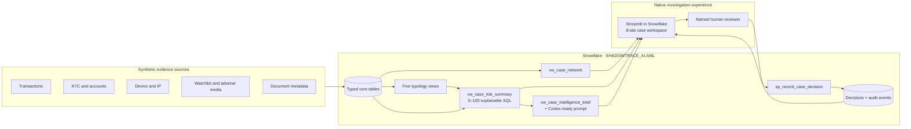
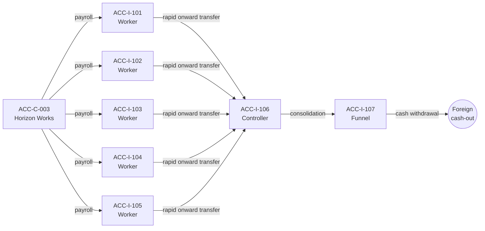

# Architecture

ShadowTraceAI keeps detection, explanation, application state, and audit history
inside Snowflake. The Streamlit layer is intentionally thin.

## Design decisions

### Snowflake-first

Typed Snowflake tables hold all structured evidence. Views express typology and
scoring logic, so an investigator can reproduce every score using SQL alone.
Streamlit reads those objects through the active Snowpark session.

### Deterministic score, optional generative narrative

The score and route never depend on an LLM. `vw_case_brief_prompt` packages
bounded evidence for Cortex, while `vw_case_intelligence_brief` provides a
deterministic brief when Cortex is unavailable. The optional
`05b_cortex_brief_optional.sql` demonstrates `SNOWFLAKE.CORTEX.COMPLETE`.

### Human decision gate

The system recommends a route but does not file a SAR. The reviewer must choose
one of four decisions and provide rationale. `sp_record_case_decision` stores
the decision and matching audit event in one transaction.

### Evidence safety

The dataset is wholly synthetic. Example domains use `.test`, example IP ranges
use documentation blocks, and all person/company names are fictional.

## CASE-C003 network

